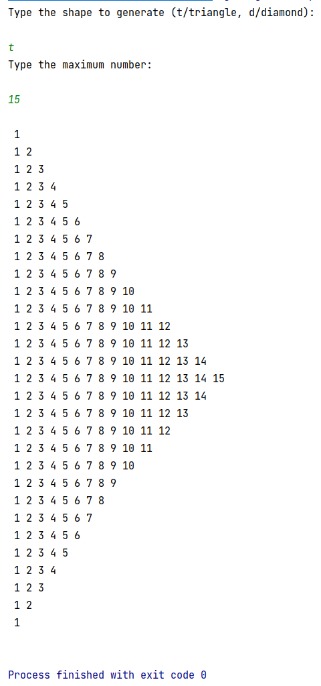
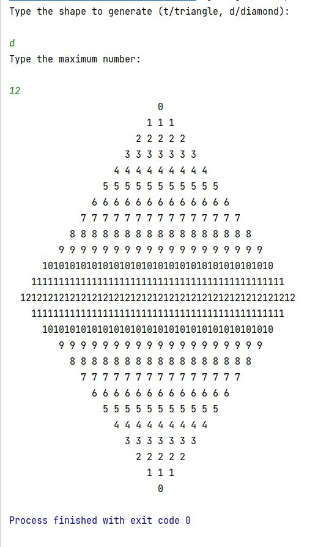

# numberShapeBuilder
Generates triangles and diamonds out of multi-digit numbers.
Simply select a shape and maximum number, and the rest is done for you.

Triangle test case: 

Diamond test case: 

